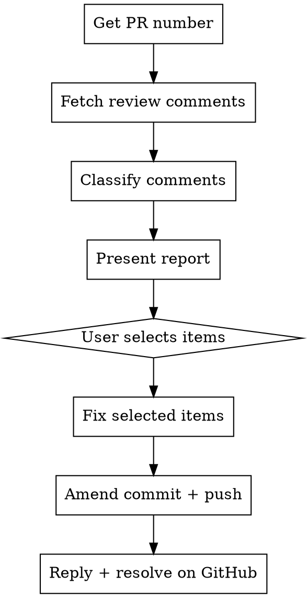

# Triage PR Reviews

## Overview

Fetch all review comments on the current branch's PR, classify them as pertinent (bugs, logic errors, correctness) vs non-pertinent (style, nitpicks, questions), present an interactive report with recommendations, then fix selected items and respond on GitHub.

## Process



### Step 1: Get the PR Number

Run `mergify stack list` and extract the PR number for the current branch.

The output format is:
```
Stack on `branch-name` targeting `origin/main`:

* [#12345] commit message (sha)
```

Extract the number from `[#NNNNN]`. The current branch is marked with `*`.
If the output shows `[no PR]`, tell the user there is no PR for the current branch.

### Step 2: Fetch All Review Comments

Use the GitHub GraphQL API to fetch review threads with full context in a single call:

```bash
gh api graphql -f query='
  query($owner: String!, $name: String!, $pr: Int!) {
    repository(owner: $owner, name: $name) {
      pullRequest(number: $pr) {
        reviewThreads(first: 100) {
          nodes {
            id
            isResolved
            isOutdated
            comments(first: 50) {
              nodes {
                id
                body
                author { login }
                path
                line
                originalLine
                diffHunk
                createdAt
              }
            }
          }
        }
      }
    }
  }
' -f owner=OWNER -f name=REPO -F pr=PR_NUMBER
```

Get OWNER and REPO from `gh repo view --json nameWithOwner`.

**Skip threads that are already resolved** (`isResolved: true`). Only process unresolved threads.

### Step 3: Classify Each Comment Thread

For each unresolved thread, read the first comment (the review comment) and classify it:

**PERTINENT** — requires a code change:
- Bug or logic error identified
- Security vulnerability
- Missing edge case or error handling
- Incorrect behavior / wrong output
- Performance issue with measurable impact

**NON-PERTINENT** — informational or stylistic:
- Style or formatting preferences
- Naming suggestions
- Questions or requests for explanation
- Praise or acknowledgment
- Suggestions that are purely cosmetic

### Step 4: Present the Report

Present a structured report using `AskUserQuestion` with multi-select. Format:

```
## PR Review Triage: PR #NNNNN

### Pertinent (N comments)

1. **[file.py:L42]** @reviewer — "summary of comment"
   Recommendation: [brief recommendation of how to fix]

2. ...

### Non-Pertinent (N comments)

1. **[file.py:L10]** @reviewer — "summary of comment"
   Why: [style nitpick / question / ...]

2. ...
```

Use `AskUserQuestion` with multi-select to ask which pertinent items to fix.
Include the non-pertinent items in the report for visibility but don't offer to fix them.

### Step 5: Fix Selected Items

For each selected item:
1. Read the relevant file and understand the surrounding code
2. Apply the fix
3. Show the user what changed (the tool output is enough, no need for extra diff)

### Step 6: Commit Fixes into the Correct Stack Commit and Push

When working with a stack of commits, fixes must go into the commit that originally introduced the file, not just HEAD. This ensures each PR in the stack stays self-contained.

After all fixes are applied:
1. Run linters on modified files: `uv run pre-commit run --show-diff-on-failure --files <changed-files>`
2. Fix any linter issues
3. Identify the target commit for each changed file:
   - Run `git log --oneline origin/main..HEAD` to list all commits in the stack
   - For each changed file, determine which commit introduced/modified it (use `git log --oneline origin/main..HEAD -- <file>` to find the earliest commit that touched the file)
   - Group changed files by their target commit
4. For each target commit, stage the relevant files and create a fixup commit:
   ```bash
   git add <files-for-this-commit>
   git commit --fixup=<target-sha>
   ```
5. Autosquash all fixup commits into their targets:
   ```bash
   GIT_SEQUENCE_EDITOR=: git rebase --autosquash origin/main
   ```
6. Run `git check` (required before pushing)
7. If `git check` left unstaged changes, stage and amend the appropriate commit again
8. Push using `mergify stack push`
9. Verify the push preserved the changes (spot-check a key file)

**Shortcut:** If all changed files belong to the same commit (common case), you only need one fixup commit. If all fixes target HEAD, you can simply `git commit --amend --no-edit` instead.

### Step 7: Reply and Resolve on GitHub

For each **fixed** comment, post a reply on the PR thread explaining the fix.

Use the REST API to reply to a review comment:
```bash
gh api repos/OWNER/REPO/pulls/PR_NUMBER/comments \
  -f body="Fixed: [brief explanation of what was changed]" \
  -F in_reply_to=COMMENT_ID
```

Where `COMMENT_ID` is the `id` (REST API numeric ID) of the first comment in the thread. To get it, fetch comments via REST:
```bash
gh api repos/OWNER/REPO/pulls/PR_NUMBER/comments --jq '.[] | {id, body: (.body[:80]), path, line}'
```

Match threads by `path` and `line`/`originalLine` to correlate GraphQL thread data with REST comment IDs.

**Thread resolution rules:**
- **Copilot reviews** (`copilot-pull-request-reviewer[bot]`) + fixed → resolve the thread via GraphQL
- **Human reviews** + fixed → reply only, do NOT resolve (leave that to the reviewer)
- **Not fixed** → no action

To resolve a thread (copilot only):
```bash
gh api graphql -f query='
  mutation($threadId: ID!) {
    resolveReviewThread(input: {threadId: $threadId}) {
      thread { isResolved }
    }
  }
' -f threadId=THREAD_ID
```

## Important Notes

- Always use `mergify stack list` to get the PR number, not `gh pr view`
- Only process **unresolved** threads
- The report should be concise — summarize long comments, don't reproduce them in full
- Always amend and push fixes before replying on GitHub, so the reply references code that's already in the PR
- If there are no unresolved review comments, tell the user and stop
